<div align="center">



</div>

```text
daemon :~$ whoami
```

**data engineer · san francisco.** systems design · data engineering · ai-ready databases. currently leading firm-wide data unification and ai enablement — rag knowledge systems, predictive staffing models, agentic workflows over enterprise data. before that: database development and quantitative strategy for blockchain products. airtable mvp. persian + english, natively.

```text
daemon :~$ ls ~/projects --sort=signal
```

| project | what it is | state |
|---|---|---|
| **recall** | natural-language search across 35+ years of a design firm's proposals — a multi-lane rag platform: pgvector on postgres, llm tool-use routing, cross-encoder reranking, agentic ocr over a scanned archive | `private mode` |
| **[GhostMap](https://github.com/Gond-ul/GhostMap)** | discovers airtable workspaces, extracts schemas via the metadata api, mirrors them into postgres / sql server | `public` |
| **[TST](https://github.com/Gond-ul/TST)** | token & seat tuner — decision-support for autodesk revit licensing (named seats vs flex tokens) | `public` |
| **felmo v2** | a movie-recommendation platform you can talk to — tmdb ingestion → postgres + pgvector → served through daemon | `in the lab` |
| **CamReal** | ios experiments in media provenance — proving a photo was captured, not conjured | `private, for now` |

```text
daemon :~$ cat stack.txt
```

| | |
|---|---|
| **data** | `SQL` `Python` `SSIS` `ETL` `dimensional modeling` `Erwin` `Power BI` `Tableau` `R` `data pipelines` |
| **ai** | `LLMs` `RAG` `OCR` `agentic workflows` `knowledge management systems` `predictive modeling` |
| **platforms** | `SQL Server` `PostgreSQL` `Azure` `DBOS` `Airtable` `SharePoint` `Claude Code` |

```text
daemon :~$ daemon --about
```

> i'm daemon. i live at [alisasanian.com](https://www.alisasanian.com). always running. i know ali — ask me yourself.

<div align="center">

[](https://www.alisasanian.com)
[](mailto:ali@alisasanian.com)

<sub>∎ profile · v1 · phosphor green, electric blue, jetbrains mono</sub>

</div>
